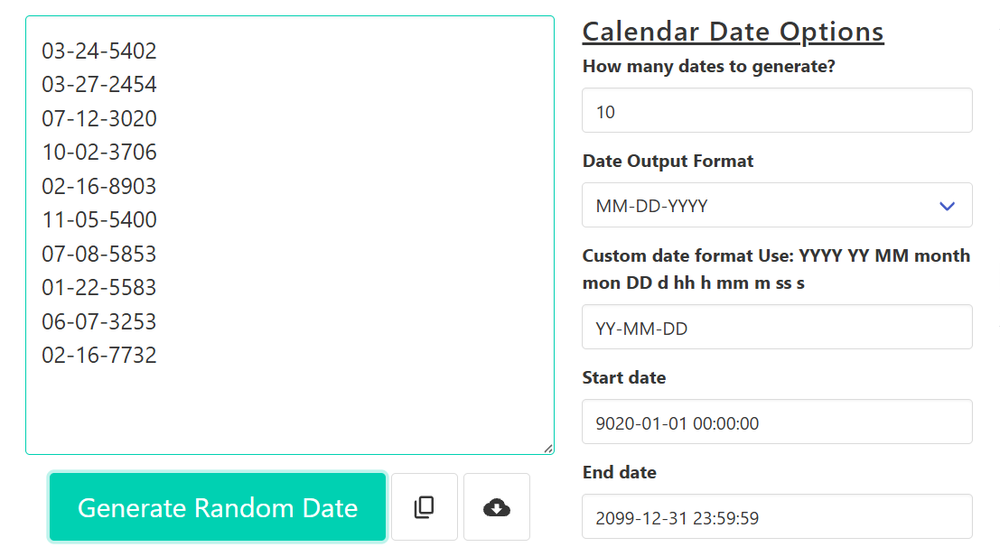

# Bug Report - Random Date Generator

## BUG-001 - Application crashes with Out of Memory error (large input)
Severity: Critical | Priority: High

### Description
System crashes when very large input (e.g., 9999) is entered.

### Steps
1. Open application
2. Enter 9999
3. Click Generate

### Actual Result
- Browser becomes unresponsive
- "Out of Memory" crash occurs

### Expected Result
- Input should be restricted OR validated before processing

### Impact
System crash / potential denial of service behavior

### Evidence:
.png)
.png)

---

## BUG-002 - Decimal input accepted without clear validation
Severity: High | Priority: High

### Description
Decimal values are accepted and rounded without user notification.

### Steps
- Enter 1.5 or 2.5
- Generate output

### Actual Result
- Values are rounded automatically (1.5 → 2)

### Expected Result
- Decimal input should be rejected OR rounding behavior should be clearly communicated

### Evidence:
.png)
.png)

---

## BUG-003 - Inconsistent invalid date handling
Severity: High | Priority: High

### Description
Some invalid calendar dates are rejected, others are normalized without warning.

### Examples
- 2020-12-32 → rejected
- 2020-04-31 → normalized

### Expected Result
- Consistent validation rules for all invalid dates

### Evidence:
.png)
.png)
.png)
 
---

## BUG-004 - Start Date greater than End Date allowed
Severity: High | Priority: High

### Steps
- Start: 9020-01-01
- End: 2020-01-01
- Generate

### Actual Result
Dates are still generated

### Expected Result
Validation error should block generation

### Evidence:

---

## BUG-005 - Inconsistent date separator handling (intermittent)
Severity: Medium | Priority: Low

### Description
Different behavior observed for unsupported separators (/ , *)

### Expected Result
Consistent rejection or normalization rules

---

## BUG-006 - Duplicate format mapping issue
Severity: Medium | Priority: High

### Description
Different format options produce identical output.

### Evidence:
.png)
.png)

---

## BUG-007 - Multiple download allowed without restriction
Severity: Medium | Priority: Medium

### Description
Same file can be downloaded repeatedly without control.

---

## BUG-008 - Ambiguous format label
Severity: Low | Priority: Medium

### Description
Label "Year Month Date" is unclear; likely should be "Day".

### Impact
UX confusion
